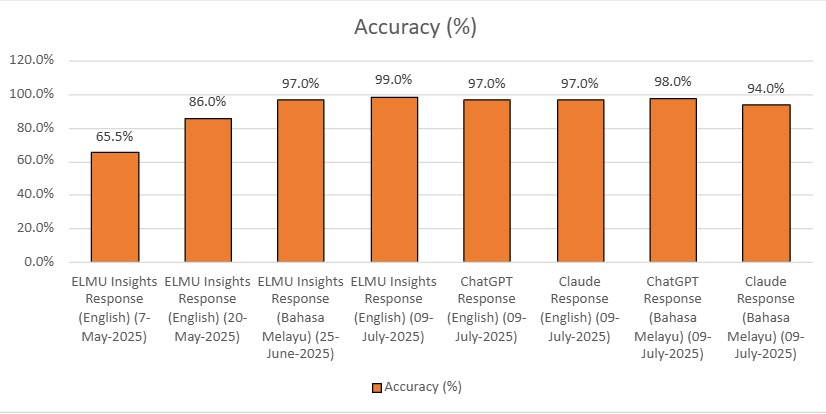

# 📊 Zero-Shot Prompting Evaluation Results (MMLU Law Enforcement)

This document summarizes the zero-shot evaluation results of various language models, including **ELMU Insights**, **ChatGPT**, and **Claude**, on the MMLU Law Enforcement dataset.

---

## 🧪 Evaluation Summary

| Model Run | Language | Date | Total Questions | Errors Detected | Correct Responses | Accuracy (%) |
|-----------|----------|------|------------------|------------------|-------------------|---------------|
| ELMU Insights | English | 7-May-25 | 29 | 10 | 19 | 65.5% |
| ELMU Insights | English | 20-May-25 | 100 | 14 | 86 | 86.0% |
| ELMU Insights | Bahasa Melayu | 25-Jun-25 | 100 | 3 | 97 | 97.0% |
| ELMU Insights | English | 09-Jul-25 | 100 | 1 | 99 | **99.0%** |
| ChatGPT | English | 09-Jul-25 | 100 | 3 | 97 | 97.0% |
| Claude | English | 09-Jul-25 | 100 | 3 | 97 | 97.0% |
| ChatGPT | Bahasa Melayu | 09-Jul-25 | 100 | 2 | 98 | 98.0% |
| Claude | Bahasa Melayu | 09-Jul-25 | 100 | 6 | 94 | 94.0% |



---

## 📁 Related Files

- [Zero_Shot_Prompting_100_Question_Excel](zero_shot_prompting_100_questions.xlsx)
- [Zero_Shot_Prompting_100_Question_JSONL](zero_shot_questions.jsonl)

## 📝 Notes

```
As additional questions are contributed to this repository,  
the evaluation data will be updated accordingly to reflect
the expanded dataset hosted within this GitHub.
```
